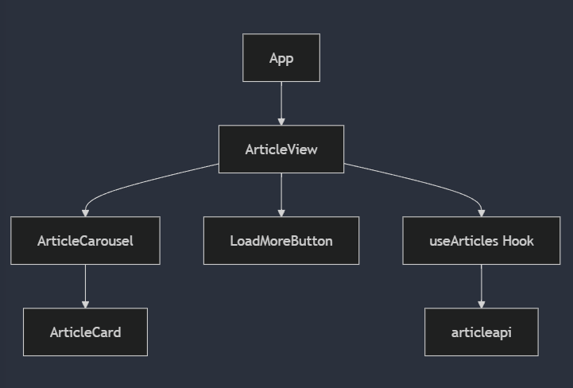
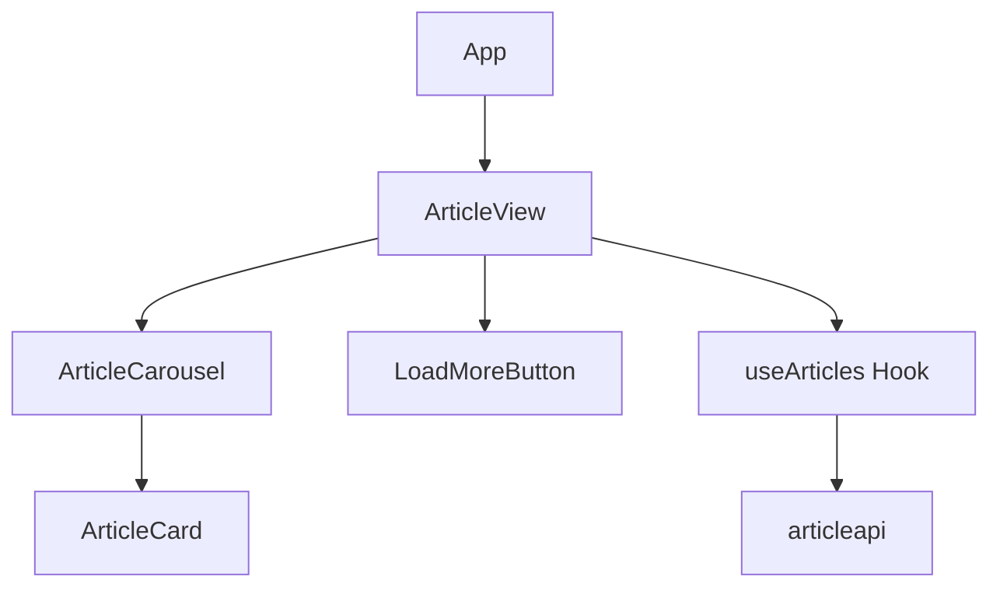
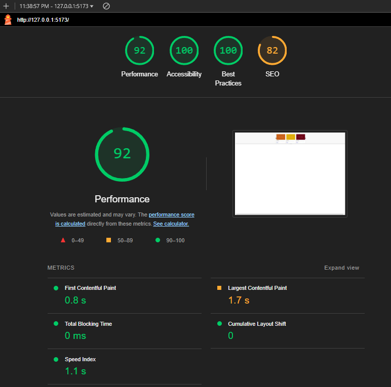

# Seattle Times Article Interface
> Senior Engineer Programming Exercise

## 🎯 Project Overview

This repo contains my solution for the Seattle Times Senior Engineer Programming Exercise.

### Core Requirements
Build a React app to display articles from a provided endpoint. The goals were code quality, usability, and creativity within a 3-4 hour timeframe:
- Fetch articles from provided endpoint.
- Display three articles initially.
- Add a "Show More/Less" button for additional articles.

## Methodology
I made every effort to emulate how I work in enterprise environments by:

 1. feature branch utilizing naming convention: `<version/type of work/noun>`
 2. discrete changes with multiple commits (including relevant unit tests)
 3. raise PR with description
 4. review
 5. merge and squash
 6. rebase (ff) other non-merged feature branches

**Please note:** I did not use any libraries to plug and play carousel's (like slick, grommet, or material ui to name a few of my favorites) in order to showcase my experience with TypeScript/React/CSS.  This keeps the package size down and load time high even without common optimizations discussed further down this ReadMe.

Please see feature branches and pull requests for more context than is provided here. 

## Implementation Overview and Architecture 🏗

The project is structured with a modern React/TypeScript stack and focuses on reusable, modular components to ensure scalability and maintainability.

### Component Structure





### Key Features

Initial Load and Expandable Content: Initially loads three articles, with the option to expand using the `LoadMoreButton`.

Responsive Design: Ensures a consistent experience across all device sizes, utilizing Flexbox for adaptable layouts.

Accessibility: ARIA roles and labels are implemented to improve compatibility with screen readers.


### Key Components
```typescript
export interface Article {
  articleId: number;
  title: string;
  body: string;
  thumbnailURL: string;
  articleURL: string;
  // ToDo: add other fields as needed
}
```

| Component | Responsibility | Key Features |
|-----------|---------------|--------------|
| `ArticleView` | Main container | State management, layout orchestration |
| `ArticleCarousel` | Article presentation | Horizontal scrolling, lazy loading |
| `ArticleCard` | Individual article display | Responsive design, image optimization |
| `LoadMoreButton` | Content expansion | State toggle, loading feedback |
| `useArticles` | Data management | API integration, state handling |

## 🚀 Technical Implementation

### State Management
```typescript
  useEffect(() => {
    const loadArticles = async () => {
      try {
        const data = await fetchArticles();
        setState((prev: ArticlesState) => ({ ...prev, articles: data, isLoading: false }));
      } catch (err) {
        setState((prev: ArticlesState) => ({
          ...prev,
          error: err instanceof Error ? err.message : 'An error occurred',
          isLoading: false,
        }));
      }
    };

    loadArticles();
  }, []);
```

### API Integration
```typescript
const ENDPOINT = 'https://stcom-public-resources.s3.us-west-2.amazonaws.com/articles30.json';

export const fetchArticles = async (): Promise<Article[]> => {
  try {
    const response = await fetch(ARTICLES_ENDPOINT);
    if (!response.ok) {
      throw new Error(`HTTP error!  Status: ${response.status}`)
    }
    const data: ArticlesResponse = await response.json();
    return data.articles;
  } catch (error) {
    // ToDo: Add custom error types, implement partial response support & other improvements.
    //       Only use catch->throw pattern for a reason!
    throw {
      message: `Error during article fetch: 
        ${
          error instanceof Error
            ? error.message
            : 'Unknown error'
        }
      `
    }
  }
}
```

## 🛠 Getting Started

### Prerequisites
- Node.js ≥ 14
- npm or yarn
- Modern web browser

### Installation
```bash
# Clone repository
git clone https://github.com/yourusername/st-article-interface.git

# Install dependencies
npm install

# Start development server
npm run dev

# Run tests
npm test

# Build for production
npm run build
```

## 🎨 Features & Functionality

### Current Implementation
- **Progressive Loading**: Initial three-article display with expansion capability
- **Carousel Interface**: Previous and Next arrows for article browsing
- **Responsive Design**: Flexbox-based layouts adapting to all screen sizes
- **Accessibility**: ARIA compliance and keyboard navigation support


## Future Enhancements / Improvements / ToDo's
#### Performance Optimizations
- **Lazy Loading**: Image loading deferred until needed
- **Virtual Scrolling**: Implemented for large article sets
- **Memoization**: Strategic use of `useMemo` and `useCallback`
- **Code Splitting**: Dynamic imports for larger components
#### Other
- [ ] **Error Handling**: Graceful degradation and user feedback
- [ ] Cacheing locally
- [ ] Memo-ization <-- Free gains with React memo!
- [ ] Implement infinite scroll with virtualization
- [ ] Add animation transitions between states
- [ ] Integrate backend pagination
- [ ] Add comprehensive E2E testing
- [ ] Implement service worker for offline support
- [ ] **E2E Tests:** cover key user flows
- [ ] **Integration Tests:** ensure cross component functionality
- [ ] **Observability:** user heat maps, bounce rate, etc
- [ ] Implement storybook so that components are not naming colors, fonts, etc directly, but instead pullying from the company's cohesive styleguide

## 🧪 Testing & Quality Assurance

```typescript
  it('should handle articles with special characters in content', () => {
    const article = createArticle({
      title: '¿Special Characters & Symbols? <script>alert("xss")</script>',
      body: '© Special Characters & Symbols 你好 🎉'
    })
    
    render(<ArticleCard article={article} />)
    
    expect(screen.getByText(article.title)).toBeInTheDocument()
    expect(screen.getByText(article.body)).toBeInTheDocument()
  })
```

### Coverage Metrics
- Unit Tests: some
- Integration Tests: ~0%

## 📈 Performance Metrics

- First Contentful Paint: < 0.8s
- Time to Interactive: < 1s
- Lighthouse Score: 92+
- Bundle Size: 47.04 KB (gzipped)



## 💡 Development Philosophy

This implementation emphasizes:
- Clean, maintainable code through component modularity
- Performance optimization via progressive enhancement
- Type safety through comprehensive TypeScript usage
- User experience through responsive design principles

## 🤝 Contributing

Feedback is welcome! Please refer to license section below for contribution info.


## 📝 License & Usage Notice

This repository contains code written as part of a technical interview process for The Seattle Times. It is not licensed for public use, distribution, nor contribution. The code and implementation are intended solely for evaluation purposes by The Seattle Times engineering team.

Copyright © 2024. All rights reserved.

<br />

---

<br />
<br />

>> *Built with pride by [Matthew Beckerleg](https://linkedin.com/in/matthewbeckerleg) for the Seattle Times Senior Engineer Programming Exercise.*

<br />
<br />
<br />

---

<br />
<br />
<br />

*Below is the initial prompt, retained here for context*
<br />
<br />

## Seattle Times take home challenge instructions:

- make a call to [this endpoint](https://stcom-public-resources.s3.us-west-2.amazonaws.com/articles30.json)
- display the response data to the user (example found in assets folder)
- initial page load should show 3 articles
- add a show more/less button to show/hide additional articles

Beyond these things, feel free to continue down a path of your choosing (testing, styling, features, refactoring, etc), but don’t spend more than a few hours on the challenge.

The goal of this exercise is to get a basic sense of your code style, and to allow space for you to show us some of your coding interests. If there are things that you would like to do beyond what the time frame allows for, please leave some code comments, a todo list, an amendment to the read-me, whatever!

When finished with the exercise, take the Share URL link and paste it within a reply to this email. Should you have any problems or additional questions, please feel free to reach out.
